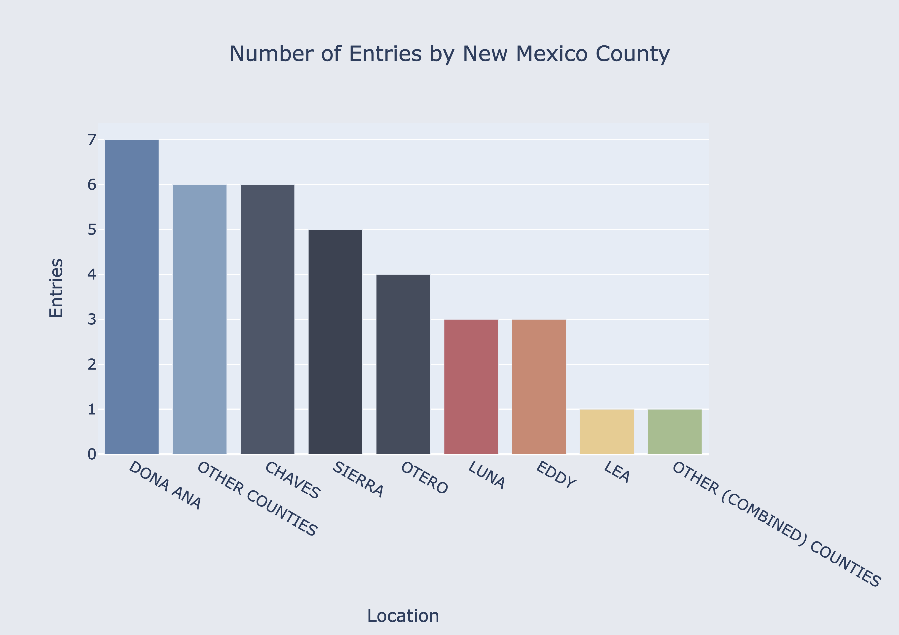

# Abstract

This study explores and develops new methodologies for predicting agricultural outcomes, such as crop yields, in microclimates characterized by sparse meteorological data. Specifically, it focuses on reducing the dimensionality in time series data as a preprocessing step to generate simpler and more explainable forecast models. Dimensionality reduction helps in managing large data sets by simplifying the information into more manageable forms without significant loss of information. We explore and utilize various 'similarity' metrics, including Kullback-Leibler Divergence, Euclidean Distance Distance, Cosine Similarity, Pearson Correlation, and Spearman Rank Correlation. These metrics help in identifying patterns and relationships across different microclimate features for both locations and seasons (time and space dimensions). We analyze continuous, temporally aligned data streams from two distinct geographic locations to assess the similarity of various weather features like temperature, humidity, cloud cover and many more. This involves comparing long-term weather patterns to identify common traits that might influence crop yields. Additionally, we examine seasonal blocks of meteorological data across different seasons within the same geographic region and separate geographic regions. Analyzing data in blocks helps in understanding how seasonal variations impact agricultural outcomes. This information is leveraged as input for multiple machine learning techniques, ranging from small classical models to advanced approaches like Long Short Term Memory Neural Networks. These models are adept at handling complex, high-dimensional data and extracting meaningful predictions. The study employs high-dimensional temporal datasets from four geographic regions in New Mexico (Otero, Sierra, Doña Ana, and Chaves) as input data, with pecan crop yields as the ultimate outcome of interest. Although still in the preliminary stages, early models suggest a strong predictive link between similar microclimates and agricultural outcomes like crop yield. Moving forward, we propose future avenues of research to refine these predictive models. We also propose to explore a new Mixture of Experts architecture, which combines insights from various specialized models to provide more precise and localized predictions across different agricultural regions. This research, still in its early stages, holds promise for improving forecasting practices in agriculture.

# Keywords
Agricultural outcomes prediction, Crop yields, Microclimates, Sparse meteorological data, Dimensionality reduction, Time series data, Forecast models, Similarity metrics, Kullback-Leibler Divergence, Euclidean Distance Distance, Cosine Similarity, Pearson Correlation, Spearman Rank Correlation, Weather features, Temperature, Humidity, Cloud cover, Temporal data streams, Geographic locations, Seasonal variations, Machine learning techniques, Riemannian learning, Long Short Term Memory Neural Networks., High-dimensional data, Pecan crop yields, New Mexico regions, Otero, Sierra, Doña Ana, Chaves, Mixture of Experts architecture, Predictive models, Forecasting practices in agriculture

# Introduction

Agriculture is a cornerstone of the global economy, providing essential resources such as food, fiber, and fuel to sustain human life. The success of agricultural endeavors is intrinsically linked to a multitude of factors, among which climate plays a pivotal role. Climate variables such as temperature, humidity, and precipitation significantly influence crop growth, development, and yields. Therefore, understanding and accurately predicting the relationship between climate and agricultural outcomes is vital for optimizing farming practices, enhancing productivity, and ensuring food security.

One of the challenges in agricultural forecasting is the variability of microclimates—localized climate conditions that can differ significantly from the broader regional climate. Identifying and understanding these microclimates can provide valuable insights into crop performance under diverse environmental conditions. This study focuses on leveraging similarities between geographically distinct microclimates to improve predictive models for agricultural outcomes, specifically crop yields.

Dimensionality reduction in time series data is employed as a preprocessing step to simplify complex datasets, making them more manageable and interpretable without substantial loss of information. Various similarity metrics, including Kullback-Leibler Divergence, Euclidean Distance Distance, Cosine Similarity, Pearson Correlation, and Spearman Rank Correlation, are utilized to identify patterns and relationships across different microclimate features over both spatial and temporal dimensions.

In this study, we analyze continuous, temporally aligned meteorological data streams from two distinct geographic locations to assess the similarity of weather features such as temperature, humidity, and cloud cover. By comparing long-term weather patterns, we aim to identify common traits that may influence crop yields. Additionally, we examine seasonal blocks of meteorological data to understand how seasonal variations impact agricultural outcomes within the same geographic region and across different regions.

We apply these insights as inputs for various machine learning models, ranging from traditional statistical methods to advanced techniques like Long Short-Term Memory (LSTM) neural networks. These models are capable of handling complex, high-dimensional data and generating meaningful predictions. The study utilizes high-dimensional temporal datasets from four geographic regions in New Mexico (Otero, Sierra, Doña Ana, and Chaves), with pecan crop yields as the primary outcome of interest. Despite the limited dataset—23 entries spanning six years across the top four locations in New Mexico—preliminary models demonstrate a strong predictive relationship between similar microclimates and agricultural outcomes.

This research is still in its early stages, yet it shows promise for enhancing forecasting practices in agriculture. Future work will focus on refining these predictive models and exploring a new Mixture of Experts architecture, which integrates insights from specialized models to deliver more accurate and localized predictions for different agricultural regions. By advancing our understanding of microclimate similarities and their impact on crop yields, this study aims to contribute to the development of more reliable and precise agricultural forecasting methods.

# Methods

## Dataset Preperation

### Data Source and Description

For this study the data was obtained from two locations. For all crop yield data for Pecans in the 4 described regions in New Mexico we obtained the data frrom https://quickstats.nass.usda.gov/ where there is county-level agricultural yield data for various crops on an annual basis. For all of the meteorological data we utilized the Open Weather API at https://openweathermap.org/api. This API provides extensive information on an hourly update for many key features. The features analyzed for our models purpose included: lattitude, longitude, dew point, percieved temperature, minimum temperature, maximum temperature, humidity, wind speed, wind degree, cloud cover, and weather id. For this study we selected 4 locations in New Mexico: Dona Ana, Chaves, Sierra, and Otero. These four locations were selected on the basis that they contained the longest spannning yield information for pecan yield. See graph below. . From the graph we can see that there are 7 entries for Dona Ana, 6 for Chaves, 5 for Sierra, and 4 for Otero totalling to 22 entries. 

### Data Preperation

In order to get actionable insights special care must be taken for aligning the 4 weather streams (S_1, S_2, S_3, S_4) temporally. Even being off by one day could cause dramatic changes in similarity scores betwen S1-S4. There were also several features in the weather data that did not meet a threshold of having at minimum 60% of the data filled in these were removed from the dataset. The features that were removed include: visibility, wind gust, rain 1h, rain 3h, snow 1h, snow 3h. For the yield dataset the only relevant columns that were needed were the county and the yield measured in lb/acre. No futhre data cleaning was needed for taking the similarity scores between weather streams. However for building predictive models we crafted datasets from the yield and meteorological data in several different ways to see what kind of combination would be most beneficial. dataset 1 (D_1) we paired the similarity scores derived from the similarity calcualtions with the respective yields that were produced between the 2 counties on which the similarity scores were calctulated on. Dataset 2 (D_2) we paired the yield for each year up with each instance for that geographical locations that spanned over that year. Dataset 3 (D_3) we condensed the meteorological dataset down by computing the mean for each feature accross the 24 instances in each features day reducing the datset from 192840 instances to 2557 instances. We then mapped it so that the target would be the yield from the 365 days in each year. We chose not to select it on a more seasonal basis because the growing season for pecans spans to almost a whole year anyways before havest. Finally with D3 we normalized  all the data so that our models would be less affected by the varying size of values. For normalization we used min max scaler which scaled all the data into a range between 0 and 1 by subtracting the min value from each data point for each feature then it divides the result by the range max - min of that feature. The formula for this process is found here ^^^^make this into latex showing hte general formula then  the specialized formula as it is applied to our dataset = (x - x_min) / (x_max - x_min) ^^^^ 

### Similarity Scoring

6 different similarity scoring metrics were used on our meteorological data. These includes: Cosine Similarity, Euclidean Similarity Similarity, Pearson Similarity, Spearman Similarity, Kendall Tau Similarity, Kullback-Leibler Divergence. These methods can be divided into 3 main categories vector based similarities (Cosine Similarity, Euclidean Similarity Similarity), correlation based similarities (Pearson Similarity, Spearman Similarity, Kendall Tau Similarity) and information theoretic similarity (Kullback-Leibler Divergence). Each method had varying degrees of effectiveness with finding similarity between microclimate data streams. With the correlation methods proving to be the most effective and the information methods being the least effective due to most of the KL divergence causing infinite values to be created  rendering most of the dataset useless. In the figure below you can see a heatmap showing the similarity each method found when analyzing each geographic location against eachother. 

# Results 

# Conclusions

# Acknowledgements

# References